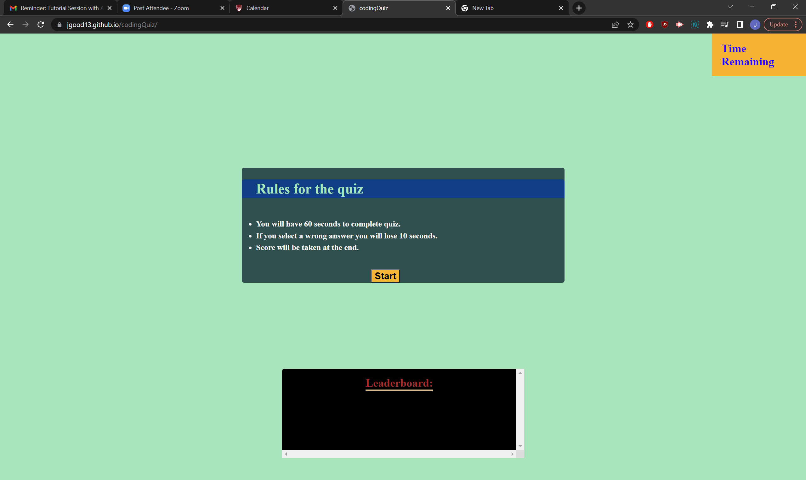

# codingQuiz

## Website description

I built a quiz that gives you rules for a quiz in which you have one minute to answer 5 questions and if you get one wrong it takes 10 seconds off of the timer which is directly correlated to your score. When you finish it will prompt you for a name or initials and then it will save them to the leaderboard. Pressing retry will put you right back into the quiz and restart the timer.

I'm still having difficulty with the Restart button. The current syntax is the only way I could get onclick to work. addEventListener and putting onclick="restart()" with restart as its own function also didn't work like it did elsewhere

## Features

1. Will alert you if you answered right or wrong.
2. 60 second timer in top-right corner.
3. leaderboard on the bottom.

# Link to page

<a href = "https://jgood13.github.io/codingQuiz/"
target="_blank"> Deployed Webpage </a>

# Screenshot

# Credits
1. <a href="https://www.w3schools.com/jsref/event_onclick.asp" target="_blank">w3 schools,</a>
2. <a href="https://developer.mozilla.org/en-US/docs/Web/API/Window/localStorage" target="_blank">MDN docs,</a>
3. <a href="https://stackoverflow.com/questions/37824645/how-to-use-object-key-inside-object-value-call" target="_blank">Stack Overflow,</a>